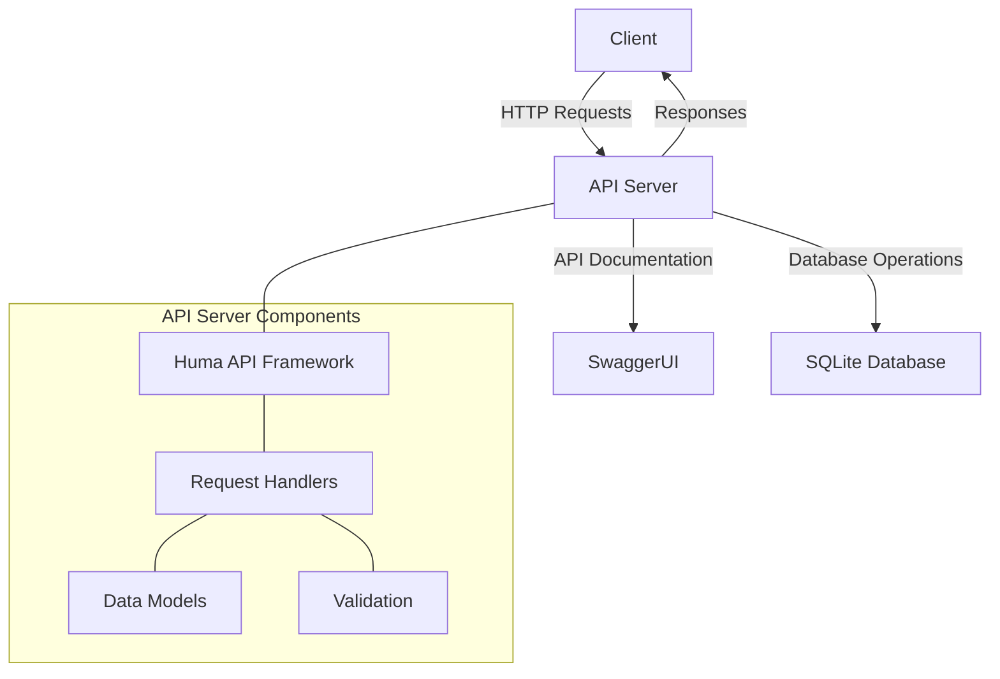
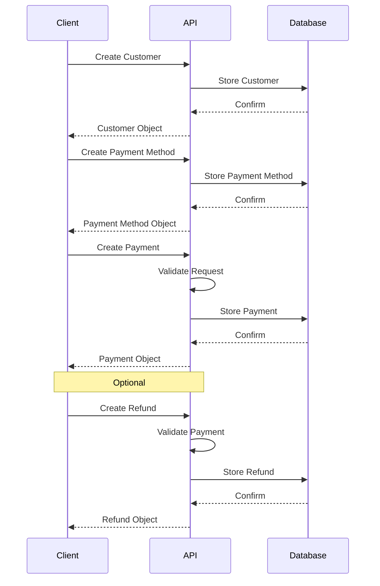

# Simple Payments API

A lightweight payment processing API built with Go, Huma, and SQLite, inspired by Stripe and Square but with a more focused feature set.


## Features

- **Modern REST API**: Clean, RESTful endpoints following industry conventions
- **Interactive Documentation**: SwaggerUI-powered API explorer and documentation
- **SQLite Database**: Simple, file-based database with zero configuration
- **Core Payment Functionality**:
  - Customer management
  - Payment method storage
  - Payment processing
  - Refund handling
- **Developer Experience**: Easy to set up and extend

## Architecture

The API is designed with a clean, modular architecture:



## API Workflow

The typical payment workflow looks like this:



## Project Structure

```
payment-api/
├── cmd/
│   └── server/
│       └── main.go         # Application entry point
├── internal/
│   ├── api/
│   │   ├── api.go          # API setup and configuration
│   │   ├── api_test.go     # API unit tests
│   │   ├── customers.go    # Customer endpoints
│   │   ├── payments.go     # Payment endpoints
│   │   ├── methods.go      # Payment method endpoints
│   │   └── refunds.go      # Refund endpoints
│   ├── models/
│   │   ├── customer.go     # Customer model
│   │   ├── customer_test.go # Customer model unit tests
│   │   ├── payment.go      # Payment model
│   │   ├── method.go       # Payment method model
│   │   └── refund.go       # Refund model
│   └── db/
│       ├── db.go           # Database setup and operations
│       └── db_test.go      # Database unit tests
├── payments.db             # SQLite database file (created at runtime)
├── go.mod                  # Go module definition
├── go.sum                  # Go module checksums
├── run.sh                  # Convenience script for running the application
├── e2e_test.sh             # End-to-end test script
└── README.md               # This documentation
```

## Prerequisites

- Go 1.24 or higher
- Git (for version control)

## Setup Instructions

1. **Clone the Repository**

```bash
git clone https://github.com/jeffgrover/payment-api.git
cd payment-api
```

2. **Install Dependencies**

```bash
go mod tidy
```

3. **Run the Application**

You can use the provided shell script for convenience:

```bash
# Make the script executable (if needed)
chmod +x run.sh

# Run the application
./run.sh server
```

Or run it directly with Go:

```bash
go run cmd/server/main.go
```

The server will start on port 8080, and you'll see output like:

```
INF Starting Payments API server
INF Starting API server addr=:8080
INF API documentation available at docs=http://localhost:8080/docs
```

4. **Browse API Documentation**

Open your browser and navigate to http://localhost:8080/docs to explore the API using the SwaggerUI interface.

## API Endpoints

### Customers
- `POST /v1/customers` - Create a customer
- `GET /v1/customers/{id}` - Retrieve a customer
- `GET /v1/customers` - List customers

### Payment Methods
- `POST /v1/payment_methods` - Create a payment method
- `GET /v1/payment_methods/{id}` - Retrieve a payment method
- `GET /v1/payment_methods` - List payment methods

### Payments
- `POST /v1/payments` - Create a payment
- `GET /v1/payments/{id}` - Retrieve a payment
- `GET /v1/payments` - List payments

### Refunds
- `POST /v1/refunds` - Create a refund
- `GET /v1/refunds/{id}` - Retrieve a refund
- `GET /v1/refunds` - List refunds

## Example Usage

### Create a Customer

```bash
curl -X POST http://localhost:8080/v1/customers \
  -H "Content-Type: application/json" \
  -d '{"email":"customer@example.com","name":"John Doe"}'
```

### Create a Payment Method

```bash
curl -X POST http://localhost:8080/v1/payment_methods \
  -H "Content-Type: application/json" \
  -d '{
    "customer_id":"cus_1234567890",
    "type":"card",
    "card_number":"4242424242424242",
    "exp_month":12,
    "exp_year":2025,
    "cvc":"123"
  }'
```

### Create a Payment

```bash
curl -X POST http://localhost:8080/v1/payments \
  -H "Content-Type: application/json" \
  -d '{
    "amount":2000,
    "currency":"usd",
    "customer_id":"cus_1234567890",
    "payment_method_id":"pm_1234567890",
    "description":"Payment for order #1234"
  }'
```

## Development

### Using the Run Script

The `run.sh` script provides several commands to make development easier:

```bash
# Run the application
./run.sh server

# Build the application
./run.sh build

# Run unit tests
./run.sh test

# Run end-to-end tests (handles setup/teardown automatically)
./run.sh e2e

# Reset the database (delete payments.db)
./run.sh reset-db

# Clean build artifacts
./run.sh clean

# Run with hot reload (using Air)
./run.sh dev

# Show help
./run.sh help
```

### Auto-Reloading During Development

For a better development experience, you can use [Air](https://github.com/cosmtrek/air) for hot reloading:

```bash
# Install Air
go install github.com/cosmtrek/air@latest

# Run with Air directly
air

# Or use the run script
./run.sh dev
```

### Building for Production

```bash
# Using the run script
./run.sh build

# Or directly with Go
go build -o payment-api ./cmd/server
```

### Testing

The project includes both unit tests and end-to-end tests.

#### Running Unit Tests

Unit tests cover the core functionality of the API, models, and database operations:

```bash
# Using the run script
./run.sh test

# Or directly with Go
go test ./...
```

#### Running End-to-End Tests

The end-to-end tests simulate a complete user flow, from creating a customer to processing a refund:

```bash
# Using the run script
./run.sh e2e

# Or directly
./e2e_test.sh
```

The e2e test script will:
1. Automatically handle setup and teardown:
   - Stop any running server
   - Reset the database
   - Start a new server instance
   - Run the tests
   - Stop the server when done

2. Test the complete payment workflow:
   - Create a customer
   - Create a payment method
   - Create a payment
   - Process a refund
   - Verify each step with GET requests

This provides a comprehensive test of the entire API workflow without requiring a test framework.

#### Resetting the Database

If you need to start with a clean database manually, you can use the reset-db command:

```bash
./run.sh reset-db
```

This will delete the payments.db file, which will be recreated the next time you start the application.

## Future Enhancements

- Add authentication (JWT or API Keys)
- Implement rate limiting
- Add webhook notifications
- Support for additional payment methods
- Dockerize the application

## License

This project is licensed under the MIT License - see the LICENSE file for details.
